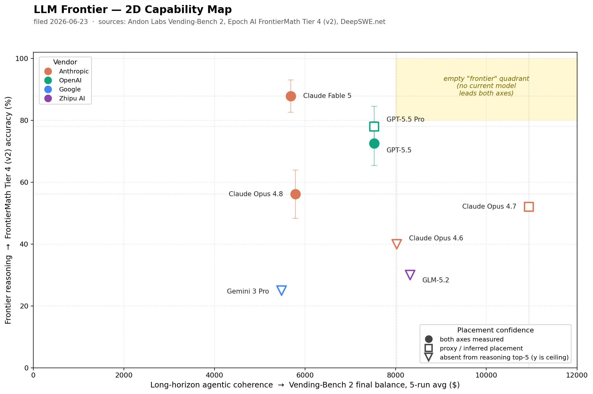

# The Frontier Leaderboard — 2D Ranking

> **Filed:** 2026-06-23 · **Refresh cadence:** rolling, whenever a new benchmark score lands on any tracked source · **Axes:** [frontier reasoning](concepts/frontier-reasoning.md) (vertical), [long-horizon agentic coherence](concepts/long-horizon-agentic-coherence.md) (horizontal)

This is the single page most readers come to the wiki for. It
places every tracked frontier Large Language Model (LLM) on the
two axes the wiki defends as load-bearing — *frontier reasoning*
(intellectual ceiling on research-grade problems) and
*long-horizon agentic coherence* (the user's "long-term execution"
intuition, named more precisely).

For the longer-form story behind the two-axis structure see
[overview.md](overview.md); for the benchmark numbers that
support every placement see the
[benchmark leaves](benchmarks/benchmarks.md) and the per-model
score tables on the [model leaves](models/models.md).

## TL;DR ranking

| Axis | Rank 1 | Rank 2 | Rank 3 | Rank 4 | Rank 5 |
|------|--------|--------|--------|--------|--------|
| **Frontier reasoning** (FrontierMath Tier 4 v2 primary) | [Claude Fable 5](models/claude-fable-5.md) — 87.8% ±5.2 | [GPT-5.5 Pro](models/gpt-5-5.md) — 78.0% ±6.5 | [GPT-5.5](models/gpt-5-5.md) — 72.5% ±7.1 | [Claude Opus 4.8](models/claude-opus-4-8.md) — 56.1% ±7.8 | — |
| **Long-horizon agentic coherence** (Vending-Bench 2 primary) | [Claude Opus 4.7](models/claude-opus-4-7.md) — $10,936.76 (5-run avg) | [GLM-5.2](models/glm-5-2.md) — $8,313.78 | [Claude Opus 4.6](models/claude-opus-4-7.md) — $8,017.59 | [GPT-5.5](models/gpt-5-5.md) — $7,523.84 | Claude Sonnet 4.6 — $7,204.14 |

[Claude Opus 4.7](models/claude-opus-4-7.md) is now the **outright
Vending-Bench 2 leader** at $10,936.76 — the first model past $10k on
the eval, ~$2,600 clear of rank-2 [GLM-5.2](models/glm-5-2.md) and
~$2,900 above its own predecessor Opus 4.6. This refresh (official
[Andon Labs leaderboard](https://andonlabs.com/evals/vending-bench-2),
accessed 2026-06-23) supersedes the 2026-06-22 reading, built from a
lagging mirror, that placed Opus 4.6 first and treated Opus 4.7 as a
vendor pick with no canonical filing.

## The 2D chart

Horizontal axis is **long-horizon agentic coherence** (Vending-Bench 2
$ as the primary signal; DeepSWE % and SWE-PRBench attention-curve
position as secondaries). Vertical axis is **frontier reasoning**
(FrontierMath Tier 4 v2 % as the primary signal). Models with
incomplete data on either axis are placed by their best available
proxy, with the marker shape signaling placement confidence (see
legend on the chart).

> Regenerate with `python3 scripts/generate_frontier_chart.py`; the
> script is the single source of truth for the chart's placements,
> so update it whenever a score lands or moves and re-run before
> committing.

Placement coordinates that underlie the chart, expanded:

- **Opus 4.7** at (x = $10,936.76, y ≈ 52 inferred). x is the
  Vending-Bench 2 five-run-average leader (measured); y is bracketed
  by Opus 4.8 (56.1) below and no top-5 FrontierMath filing of its own.
- **GLM-5.2** at (x = $8,313.78, y = ceiling). Rank-2 on
  Vending-Bench 2 and the top open-weights entry; above Opus 4.6.
  Not in the FrontierMath Tier 4 top-5.
- **Opus 4.6** at (x = $8,017.59, y = ceiling). Prior leader, now
  rank 3; not in FrontierMath Tier 4 top-5, so y is plotted as a
  conservative ceiling marker (down-arrow caret).
- **GPT-5.5** at (x = $7,523.84, y = 72.5 ±7.1). Now a *measured*
  Vending-Bench 2 score (rank 4), no longer a DeepSWE proxy.
- **GPT-5.5 Pro** at (x ≈ $7,524 proxy, y = 78.0 ±6.5). The board does
  not split Pro from base on Vending-Bench 2, so Pro shares the base
  x-coordinate.
- **Opus 4.8** at (x = $5,787.43, y = 56.1 ±7.8). x is the official
  rank-9 (`- High`) five-run average; documented Anthropic-side
  regression vs Opus 4.6 / 4.7 means this is *below* both on the
  horizontal axis despite being the newer model.
- **Fable 5** at (x = $5,680.26, y = 87.8 ±5.2). x is the official
  rank-10 (`- High`) five-run average — now a measured point, not the
  earlier "single best rollout" estimate. y is direct from
  FrontierMath Tier 4 v2.
- **Gemini 3 Pro** at (x = $5,478.16, y = ceiling). Its score is
  unchanged but newer models have pushed it below the top ten; not in
  FrontierMath Tier 4 top-5.

## Reading the chart

Three things the chart shows that an aggregate-score leaderboard
hides:

1. **The two axes are independent.** The reasoning leader
   ([Fable 5](models/claude-fable-5.md)) is *not* the long-horizon
   coherence leader ([Opus 4.7](models/claude-opus-4-7.md)). The
   long-horizon coherence leader is *not* the reasoning leader. This
   independence is the reason the wiki has two axes.
2. **Same-vendor models can disagree across axes.**
   [Opus 4.8](models/claude-opus-4-8.md) is a mid-frontier
   reasoner (rank 5 on Tier 4) and a documented *regression* on
   the long-horizon coherence axis vs its predecessor Opus 4.6 — the
   board now shows Opus 4.8 at rank 9, below both Opus 4.6 (rank 3) and
   Opus 4.7 (rank 1). Picking the newer model because it is newer is a
   known way to regress on the coherence axis. This is the cleanest
   example of the wiki's thesis.
3. **The "smart and competent" upper-right quadrant is empty.**
   No single tracked model leads both axes. [GPT-5.5
   Pro](models/gpt-5-5.md) is the closest — top-2 reasoning and now a
   top-4 measured Vending-Bench 2 score — but it is not the
   Vending-Bench 2 leader, and the leader (Opus 4.7) sits low on the
   reasoning axis. This is what "frontier" looks like in 2026-06:
   tradeoffs, not a single winner.

## Recommendations by job shape

- **Unsupervised long-running agent (e.g. business simulation,
  multi-hour autonomous loop):** pick
  [Claude Opus 4.7](models/claude-opus-4-7.md) — the Vending-Bench 2
  leader at $10,936.76. [GLM-5.2](models/glm-5-2.md) is the
  open-weights fallback (rank 2 at $8,313.78, now above Opus 4.6).
- **Long-horizon coding (multi-file changes, 20+ minutes of
  agentic activity):** pick [GPT-5.5](models/gpt-5-5.md). DeepSWE
  rank-1 at 70% ±4%, with the best efficiency profile of any
  top-5 entry. [Claude Opus 4.8](models/claude-opus-4-8.md) at
  58% ±5% is the Claude-line alternative.
- **Hardest reasoning ceiling (research-grade math, novel proof
  outlines):** pick [Claude Fable 5](models/claude-fable-5.md).
  87.8% ±5.2 on FrontierMath Tier 4 v2, ~10 points clear of any
  other base model. [GPT-5.5 Pro](models/gpt-5-5.md) is the
  alternative for breadth across Tiers 1–3 (87.7% there).
- **Code review (long-context attention):** the published
  paper-baseline winner is Claude Haiku 4.5, but no frontier-tier
  model has filed on the v0.4.1 paper baseline yet — see
  [SWE-PRBench](benchmarks/swe-prbench.md) for the open question.

## Caveats applying to the whole chart

- Every Vending-Bench 2 row is **operator-run by Andon Labs** on its
  own harness, not a standardized multi-vendor re-run. Cross-vendor
  comparisons should be read with that caveat.
- Some Vending-Bench 2 rows are a specific **effort tier** (`- High`
  for Opus 4.8 and Fable 5) while others carry no suffix; effort is a
  confound on this axis. See
  [reasoning-effort.md](concepts/reasoning-effort.md).
- Every reasoning row is at **`[max]` or `[xhigh]` effort**.
  Default-effort deployment will score lower.
- Every long-horizon row scores **model + scaffold jointly**.
  See [agentic-scaffolding.md](concepts/agentic-scaffolding.md).
- The user's intuition that Opus 4.7 leads the coherence axis is
  **confirmed** by the current canonical board ($10,936.76, rank 1);
  the earlier wiki snapshot trailed the official leaderboard because
  it was built from a lagging third-party mirror.

## Refresh policy

This page is regenerated whenever a new score lands on any tracked
benchmark. The schema for adding a new model is in
[../CLAUDE.md](../CLAUDE.md) under "Workflows → Ingest: adding a
new model"; the schema for adding a new benchmark is under
"Workflows → Ingest: adding a new benchmark". Each refresh should
also append a row to [log.md](log.md).

## Related wiki pages

- [overview.md](overview.md) — the longer-form story behind the
  two-axis structure and why the chart looks like it does.
- [concepts/concepts.md](concepts/concepts.md) — the two axes
  and the supporting concepts (reasoning effort, agentic
  scaffolding) that interpret the rows.
- [benchmarks/benchmarks.md](benchmarks/benchmarks.md) — the four
  benchmarks the placements draw from.
- [models/models.md](models/models.md) — one leaf per tracked
  model with full score tables and per-model caveats.
